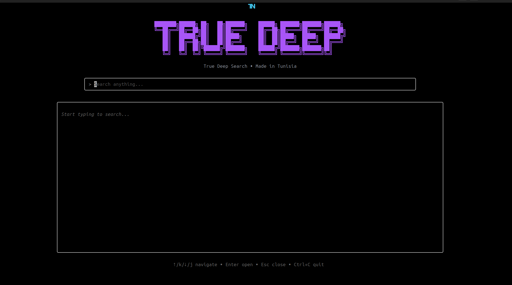
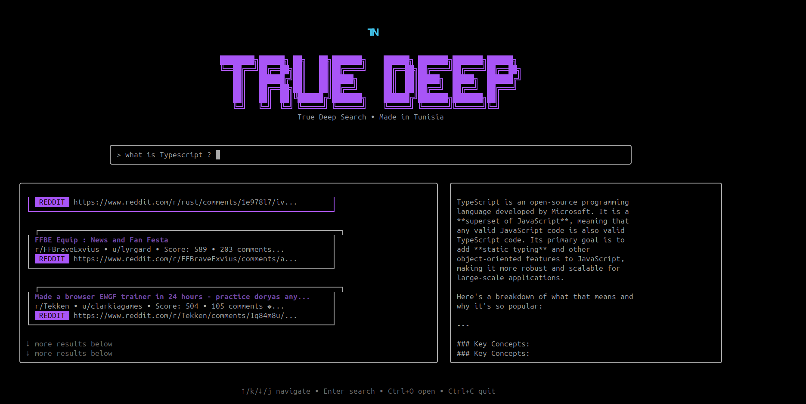

# True Deep Search

A terminal-based hybrid deep search engine in Go that combines local indexing and multi-source search into a fast, keyboard-first TUI experience.



---

## Overview

**True Deep Search** is an open-source terminal search engine built to go beyond a simple CLI wrapper.

It is designed as a real hybrid search system that combines:

- remote search providers
- local indexing and retrieval
- unified ranking and deduplication
- a keyboard-first terminal UI

Instead of searching each platform manually, True Deep Search sends one query to multiple providers, merges the results, removes duplicates, ranks them, and displays them inside a single terminal interface. This aligns with the project vision and layered architecture defined for the app. :contentReference[oaicite:1]{index=1}

---

## Features

- Fast terminal UI built with Bubble Tea
- Search input always visible
- Keyboard-first navigation
- Debounced input handling
- Concurrent multi-provider search
- Result normalization into a shared structure
- Aggregation layer
- Deduplication layer
- Ranking layer
- Local search support
- Web and API providers
- Open selected result in the browser

---

## Current Providers

- Web
- Wikipedia
- GitHub
- Stack Exchange
- Reddit
- YouTube
- Local index

---

## Demo Screenshots

### Home


### Results


---

## Why True Deep Search?

Most terminal search tools are narrow:
- one provider only
- browser-dependent
- not extensible
- not designed as a true search system

True Deep Search is different:
- hybrid by design
- provider-agnostic
- modular architecture
- terminal-native UX
- built for extensibility

---

## Architecture

The project follows a layered architecture with clear separation of concerns: UI layer, app/state layer, search orchestrator, provider layer, indexing layer, aggregation, deduplication, ranking, and infrastructure. That modular structure is part of the intended design of the project.

### Search Flow

1. User types a query
2. Input is debounced
3. The orchestrator sends the query to multiple providers
4. Providers return normalized results
5. Results are merged
6. Duplicates are removed
7. Results are ranked
8. Final results are rendered in the TUI

---

## Folder Structure

```text
hybridsearch/
├── cmd/
├── internal/
│   ├── app/
│   ├── tui/
│   ├── search/
│   ├── provider/
│   ├── index/
│   ├── aggregate/
│   ├── dedupe/
│   ├── rank/
│   ├── infra/
│   └── platform/
├── pkg/
├── configs/
├── docs/
├── scripts/
├── test/
└── README.md
```

This structure keeps the project contributor-friendly and makes the search engine easier to scale. :contentReference[oaicite:3]{index=3}

---

## Installation

Clone the repository:

```bash
git clone https://github.com/97Fakhreddine/true-deep-search.git
cd true-deep-search
```

Install dependencies:

```bash
go mod tidy
```

Run the application:

```bash
go run ./cmd/hybridsearch
```

---

## Development

Run in development mode:

```bash
./scripts/dev.sh
```

Lint the project:

```bash
./scripts/lint.sh
```

Run tests:

```bash
./scripts/test.sh
```

---

## Keyboard Controls

- `↑` / `k` → move up
- `↓` / `j` → move down
- `Enter` → open selected result
- `Esc` → close
- `Ctrl+C` → quit

---

## Roadmap

- More providers
- Better ranking
- Stronger local indexing
- Smarter query intent handling
- Richer UI
- Preview panel
- Provider filters
- Better caching

---

## Contributing

Contributions are welcome.

You can contribute by improving:
- providers
- ranking
- indexing
- UI/UX
- docs
- tests

Please read `CONTRIBUTING.md` before opening a pull request.

---

## Maintainer

This project is actively maintained by the original author.

---

## Author

**Fakhreddine Messaoudi**

- GitHub: https://github.com/97Fakhreddine

True Deep Search is designed and built as an open-source hybrid deep search engine with a focus on performance, extensibility, and real-world usability.

Made in Tunisia 🇹🇳

---

## License

MIT